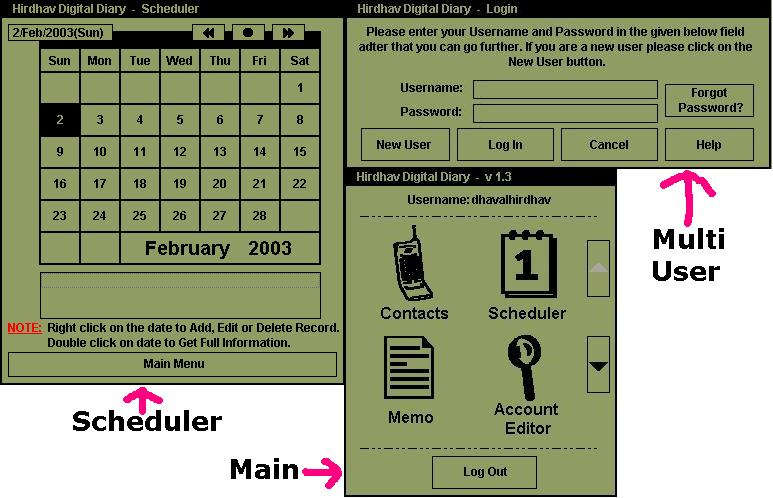



## Hirdhav Digital Diary 1\.4 \(HDD\) \- Complete Personal Organizer

### Description

This is a complete Personal Information Organizer Software,

CODE IS NOT COMMENTED.. but its very easy to understand.. even new bie can understand it very clearly.. calender part is little tough to understand.

Hirdhav Digital Diary also known as HDD, this is its 1.3 version, I wanted to know who and from where, ppl are using my this software so I created Authentication CODE software, which is included with this only, all the files which are needed is included in zip file.

if you dont want to use Authentication thing right now.. then just open Installation.dat file from HDD directory in Visual Data Manager in Visual Basic or in Microsoft Access 97 and then open table installation and in Auto field write "Yes" without quote. then it will not prompt for the Authentication Code.

also check out screen shot.. there is not just what u can see in screen shot.. there is lots of things.. then u can imagine..

Please VOTE for this code..

COMMENTS AND SUGESSIONS ARE ALWAYS WELCOME.

THANK YOU,

DHAVAL FARIA.

PS: .zip file is abt 263KB
 
### More Info
 

             |
---                |---
**Submitted On**   |2003-02-02 18:33:36
**By**             |[Dhaval Faria](https://github.com/Planet-Source-Code/PSCIndex/blob/master/ByAuthor/dhaval-faria.md)
**Level**          |Advanced
**User Rating**    |4.8 (158 globes from 33 users)
**Compatibility**  |VB 5\.0, VB 6\.0
**Category**       |[Complete Applications](https://github.com/Planet-Source-Code/PSCIndex/blob/master/ByCategory/complete-applications__1-27.md)
**World**          |[Visual Basic](https://github.com/Planet-Source-Code/PSCIndex/blob/master/ByWorld/visual-basic.md)
**Archive File**   |[Hirdhav\_Di153810222003\.zip](https://github.com/Planet-Source-Code/dhaval-faria-hirdhav-digital-diary-1-4-hdd-complete-personal-organizer__1-42883/archive/master.zip)

